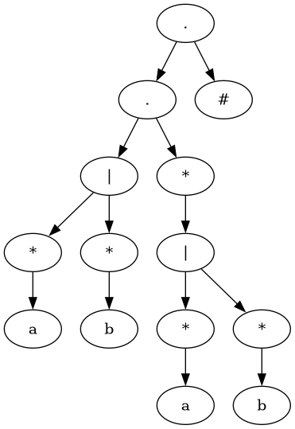
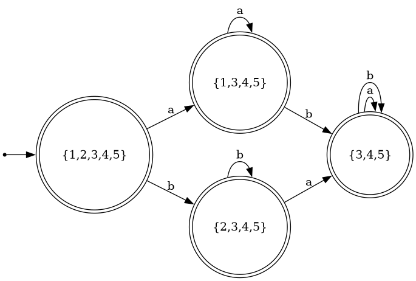
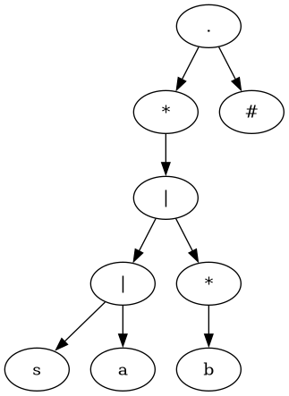
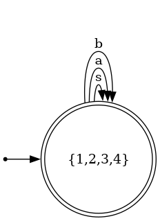
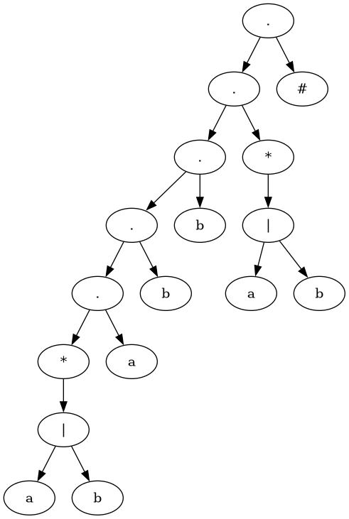
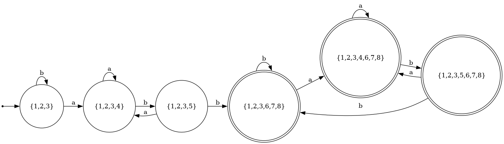
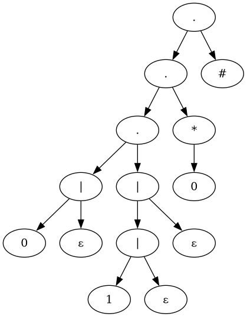
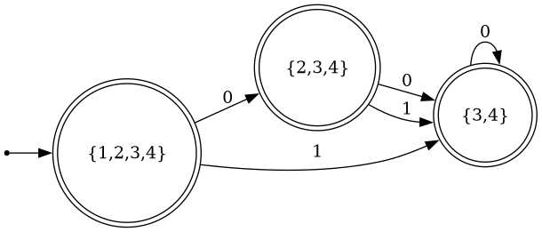

# Laboratorio 3 - CC2019

## Ejecución

### Windows PowerShell

1. Clona el repositorio:

```powershell
git clone git@github.com:JosekingUVG/lab3TeoriaCC.git
cd ~/lab3TeoriaCC/CC2019-lab02
```

2. Crea el entorno virtual si no existe:

```powershell
python -m venv .venv
```

3. Activa el entorno virtual:

```powershell
.\.venv\Scripts\Activate.ps1
```

4. Instala dependencias desde `requirements.txt`:

```powershell
pip install -r requirements.txt
```

5. Ejecuta el inciso deseado o los ejemplos de la tarea:

```powershell
python ejemplos.py
python inciso_1.py
python inciso_2.py
```

el inciso 2 descarga una imagen llamada afd.png

6. Cuando termines, desactiva el entorno:

```powershell
deactivate
```

### WSL

Si el entorno `.venv` ya existe, abre WSL y ejecuta:

```bash
cd ~/lab3TeoriaCC/CC2019-lab02
source .venv/bin/activate
```

Deberías ver algo como:

```bash
(.venv) username@username:~/lab3TeoriaCC/CC2019-lab02$
```

Ejecuta el inciso deseado o los ejemplos de la tarea:


```bash
python ejemplos.py
python inciso_1.py
python inciso_2.py
```
el inciso 2 descarga una imagen llamada afd.png


Puedes comprobar qué Python está usando:

```bash
which python
```

Debería apuntar a algo parecido a:

```bash
/home/username/lab3TeoriaCC/CC2019-lab02/.venv/bin/python
```

Cuando termines:

```bash
deactivate
```

### Si estás creando el entorno desde cero en WSL

```bash
cd ~/lab3TeoriaCC/CC2019-lab02
python3 -m venv .venv
source .venv/bin/activate
pip install -r requirements.txt
```

Después ejecuta:

```bash
python inciso_2.py
```


Una regla práctica: cuando veas `(.venv)` al inicio de tu terminal, estás trabajando dentro del entorno virtual; si no aparece, ejecuta `source .venv/bin/activate`.

## Resultados de los ejemplos: 

```
expressions = [
    "(a*|b*)+",
    "((s|a)|b*)*",
    "(a|b)*.a.b.b.(a|b)*",
    "0?.(1?)?.0*"
]
```

| Syntax_Tree | AFD |
| :---: | :---: |
|  |  |
|  |  |
|  |  |
|  |  |
| :---: | :---: |


## Referencias utilizadas

Gálvez P., T. (2026). Construcción directa de AFD [Material de clase]. Canvas, Universidad del Valle de Guatemala.  

https://mathcenter.oxford.emory.edu/site/cs171/shuntingYardAlgorithm/
    
